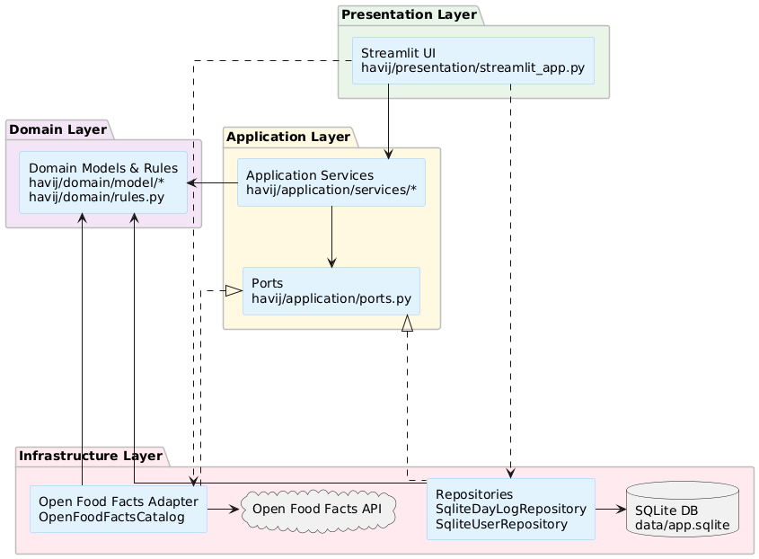
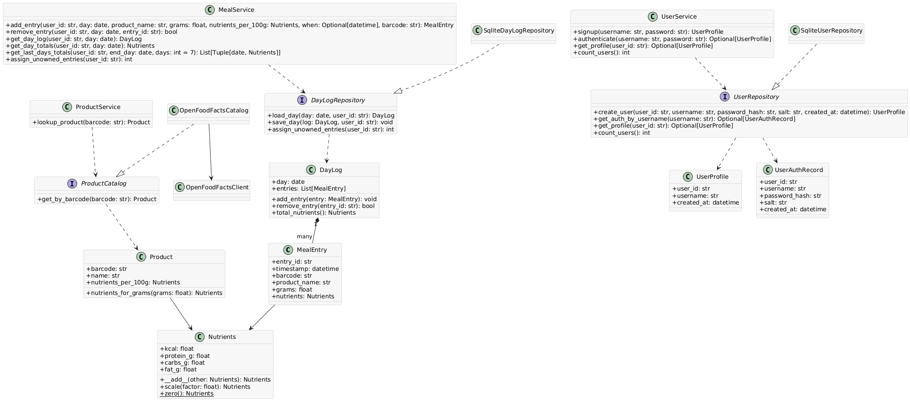
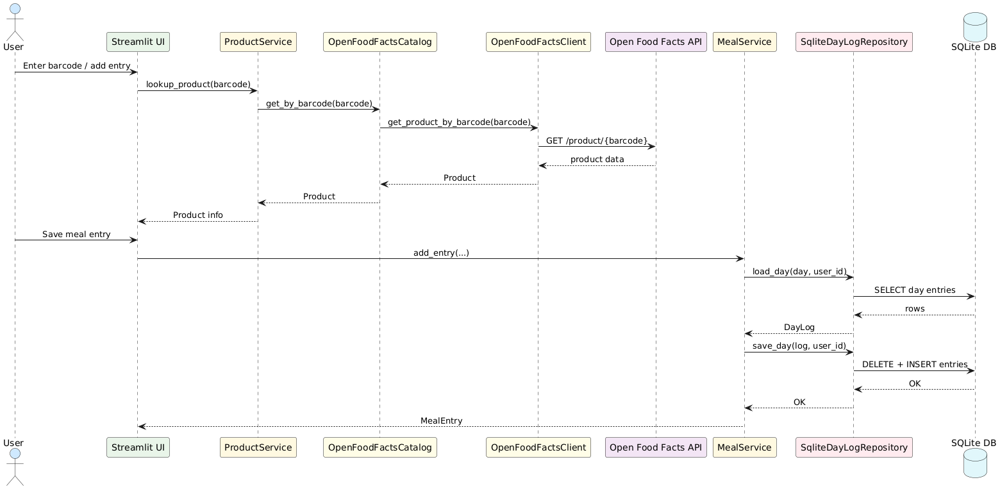
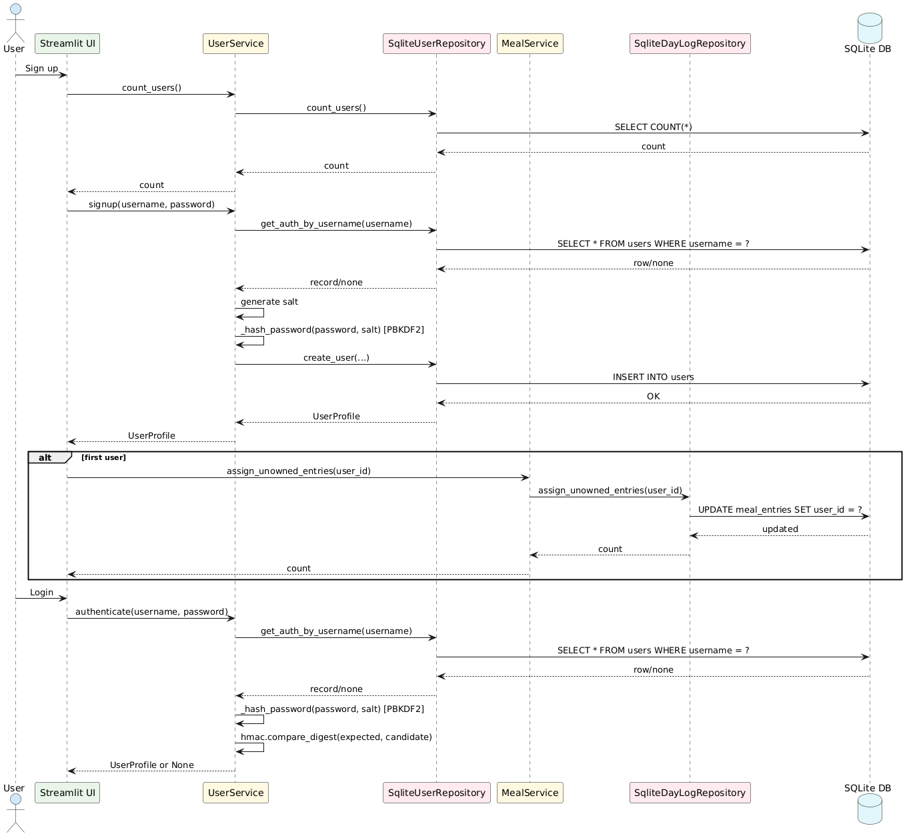
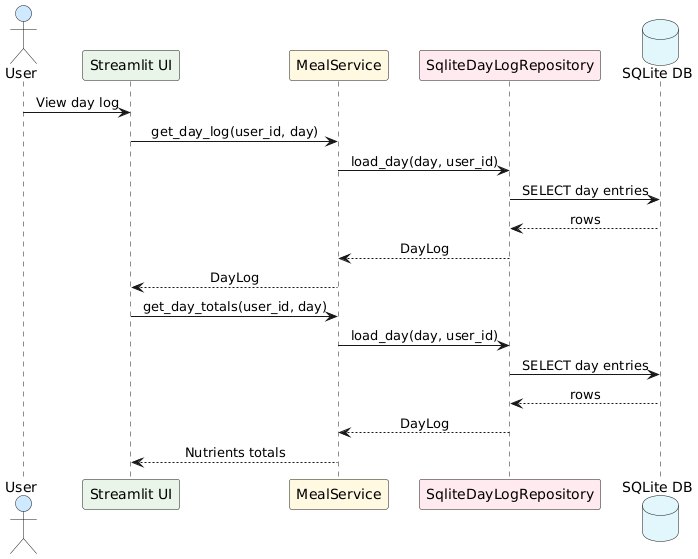
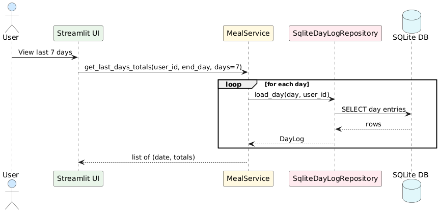

# Design

This chapter describes how the design choices map the requirements into a small, maintainable Streamlit app. The goal is a clear separation between UI, application logic, and infrastructure so the code stays easy to test and extend.

## Architecture

- Architectural style: **layered architecture** (presentation, application, domain, infrastructure). This fits a small Streamlit app with clear separation of UI, business rules, and external adapters, and keeps domain logic independent from framework and IO.
- Why not others: event-based or shared-dataspace patterns add complexity without benefit for a local, synchronous app; **hexagonal/ports-adapters** is partially adopted via Protocol ports but full inversion is unnecessary.
- Structure: layered within a single process.
  - Presentation: `havij/presentation/streamlit_app.py` (Streamlit UI, user interaction).
  - Application services: `havij/application/services/*` (use cases, validation and orchestration).
  - Domain: `havij/domain/model/*` and `havij/domain/rules.py` (core entities, value objects, invariants).
  - Infrastructure: `havij/infrastructure/*` (SQLite persistence, Open Food Facts API adapter, config).
- Responsibilities:
  - Streamlit UI: Collects input, renders tables/metrics, manages session state, and calls services.
  - Application services: Orchestrate use cases and validation (add/remove meal entries, lookup product, signup/login).
  - Domain model: Encapsulates business data and calculations (nutrient totals, scaling, validation rules).
  - Infrastructure: Persist and load data from SQLite, call the Open Food Facts API, map external data into domain objects.

<figure class="report-figure">
  
  <figcaption>Components Diagram</figcaption>
</figure>

## Infrastructure (mostly applies to distributed systems)

- This system is not distributed; it runs as a single Streamlit process on one machine.
- Components (local):
  - UI + application server: Streamlit app in a single Python process.
  - Database: SQLite file on the same machine (`data/app.sqlite` by default).
- External dependency:
  - Open Food Facts API accessed over HTTPS (outbound only).
- Discovery/naming:
  - SQLite location via `DB_PATH` environment variable (`havij/infrastructure/config.py`).
  - Open Food Facts base URL is configured in `OpenFoodFactsClient`.
  - No service discovery, load balancing, or inter-service networking needed.

## Modelling

### Domain driven design (DDD) modelling

- Bounded contexts:
  - **Meal logging:** capture meal entries, compute daily totals.
  - **Product lookup:** fetch product data by barcode.
  - **User accounts:** signup and authentication.
- Domain concepts:
  - **Entities:** `MealEntry` (entry_id), `DayLog` (day aggregate), `UserProfile` (user_id), `Product` (barcode).
  - **Value objects:** `Nutrients` (kcal/protein/carbs/fat).
  - **Aggregate:** `DayLog` is the aggregate root containing `MealEntry` and enforces basic invariants (e.g., grams > 0).
- Repositories/services:
  - **Repositories (ports):** `DayLogRepository`, `UserRepository`.
  - **Application services:** `MealService`, `ProductService`, `UserService` orchestrate use cases.
  - **Domain services:** none; domain rules are simple validation helpers in `havij/domain/rules.py`.
  - **External catalog:** `ProductCatalog` port implemented by `OpenFoodFactsCatalog`.
- Domain events:
  - None explicitly modeled; operations are synchronous with direct persistence.

### Object-oriented modelling

- Main data types:
  - `MealEntry`: `entry_id`, `timestamp`, `barcode`, `product_name`, `grams`, `nutrients`.
  - `DayLog`: `day`, `entries`, methods `add_entry`, `remove_entry`, `total_nutrients`.
  - `Nutrients`: `kcal`, `protein_g`, `carbs_g`, `fat_g`, methods `scale`, `zero`.
  - `Product`: `barcode`, `name`, `nutrients_per_100g`, method `nutrients_for_grams`.
  - `UserProfile`: `user_id`, `username`, `created_at`.
  - Services: `MealService`, `ProductService`, `UserService` orchestrate use cases.
- Relationships:
  - `DayLog` contains many `MealEntry` objects.
  - `MealEntry` embeds `Nutrients` for the consumed amount.
  - `Product` embeds `Nutrients` for per-100g values.
  - Services depend on repository/catalog interfaces (ports).
  - `MealService` creates `MealEntry` instances and persists them by loading/updating a `DayLog` via `DayLogRepository`.

<figure class="report-figure">
  
  <figcaption>Class Diagram</figcaption>
</figure>

### In case of a distributed system

- Not a distributed system; app runs as a single process with an external API call.

## Interaction

- Interaction flow:
  - UI → services: Streamlit handlers call application services for login, barcode lookup, and meal logging.
  - Services → infrastructure: `ProductService` calls `ProductCatalog` (Open Food Facts adapter), while `MealService` and `UserService` call repositories for SQLite persistence.
- Pattern:
  - Simple synchronous request/response with in-process calls and an external HTTP request for product lookup.

<figure class="report-figure">
  
  <figcaption>Sequence Diagram - Barcode Lookup and Meal Entry</figcaption>
</figure>

<figure class="report-figure">
  
  <figcaption>Sequence Diagram - Login/Sign UP</figcaption>
</figure>

<figure class="report-figure">
  
  <figcaption>Sequence Diagram - View Day Log</figcaption>
</figure>

<figure class="report-figure">
  
  <figcaption>Sequence Diagram - View Last 7 Days</figcaption>
</figure>

## Behaviour

- Component behavior:
  - Streamlit UI maintains session state (current user, lookup values) and renders logs/totals.
  - `MealService` validates grams, scales nutrients, creates `MealEntry`, updates `DayLog`, and computes daily/weekly totals.
  - `UserService` handles signup, hashes passwords with PBKDF2, and authenticates via constant-time comparison.
  - `ProductService` validates barcodes and fetches product/nutrient data.
  - Application services are stateless; repositories manage persistence through a shared SQLite connection.
  - The Open Food Facts client holds an HTTP session but no domain state.
- State updates:
  - Only services mutate state via repositories; UI remains stateless aside from session variables.
  - `MealService.assign_unowned_entries` links existing meal entries to the first created user.

## Data-related aspects (in case persistent storage is needed)

- **Stored data:**
  - Users (username, password hash, salt, created_at).
  - Meal entries (day, timestamp, barcode, product name, grams, nutrients).
  - Stored in SQLite (`data/app.sqlite` by default) for local persistence.
- **Storage model:**
  - Relational tables: `users`, `meal_entries`. SQLite is lightweight and sufficient for a single-user local app.
- **Database access:**
  - `SqliteUserRepository` queries by username or user_id, and inserts new users.
  - `SqliteDayLogRepository` loads entries by day/user (`SELECT ... WHERE day AND user_id`) , deletes and re-inserts for save.
  - Concurrency is minimal (single-process Streamlit), so no special locking needed.
- **Shared data:**
  - Only the SQLite file is shared across services within the same process; no cross-process sharing.
