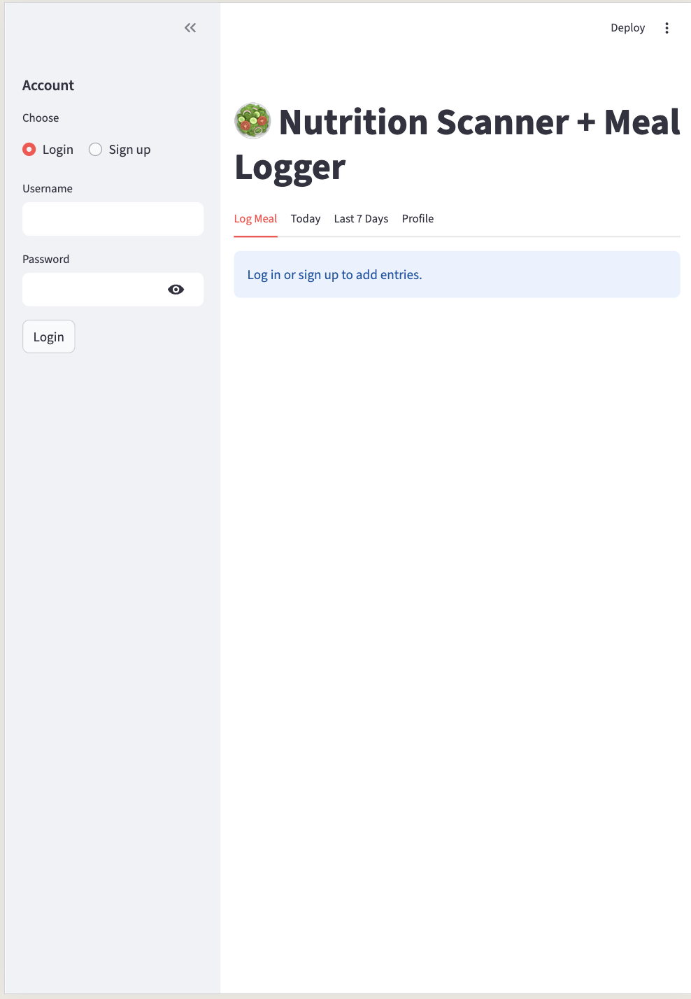
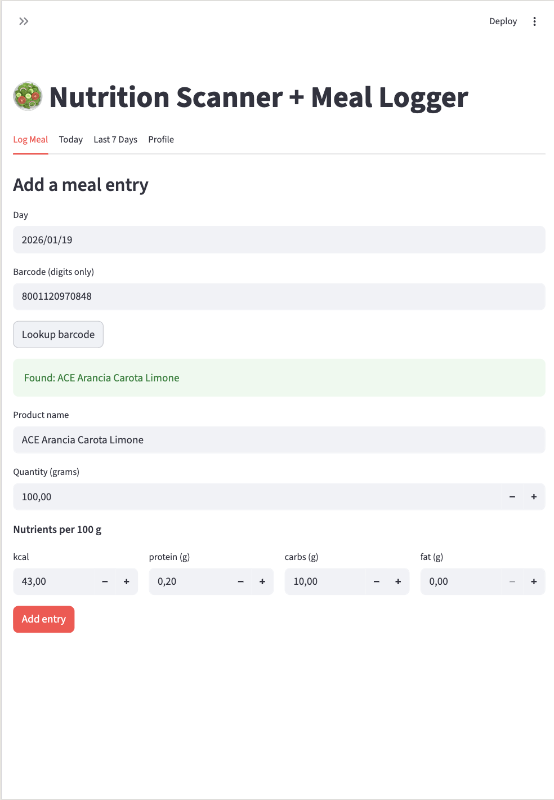
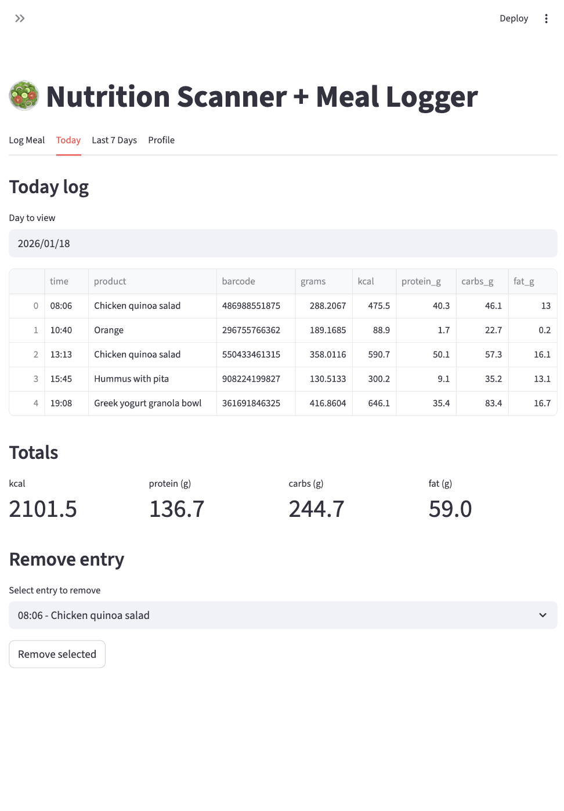
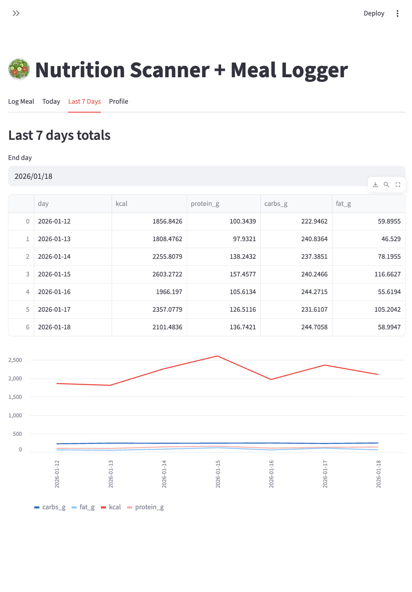
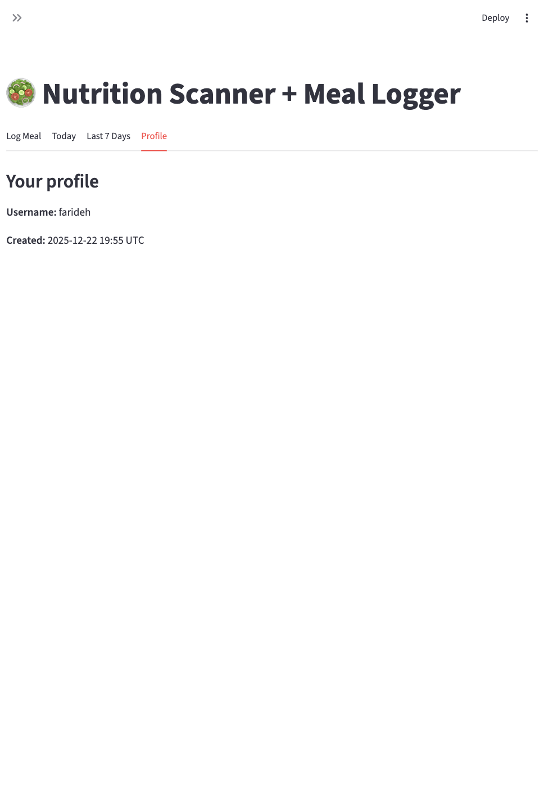

# User Guide

This guide explains how to install and use the app from a user perspective.

## Installation

Prerequisites:
- Python 3.10+
- Poetry

Steps (from the repository root):
1. Install dependencies:
   ```bash
   poetry install
   ```
2. Start the app:
   ```bash
   poetry run streamlit run havij/presentation/streamlit_app.py
   ```
3. Optional: set a custom database path:
   ```bash
   DB_PATH="data/app.sqlite" poetry run streamlit run havij/presentation/streamlit_app.py
   ```

The app will open on `http://localhost:8501` by default.

## Getting started

- Start the app and open the Streamlit page in your browser (default: `http://localhost:8501`).
- Use the sidebar on the left to create an account or log in.
- Once signed in, the main area shows four tabs: Log Meal, Today, Last 7 Days, and Profile.

## Account (sidebar)

- **Sign up**: choose "Sign up", enter a username, a password, and confirm the password. Usernames must be unique.
- **Login**: choose "Login", enter your username and password.
- **Log out**: click "Log out" to end the session.

If you create the first account in a new database, any existing unowned meal entries (if any were created before users existed) are automatically assigned to you.

<figure class="report-figure">
  
  <figcaption>Login/Sign up sidebar.</figcaption>
</figure>

## Log Meal tab

Use this tab to add a new meal entry.

1. **Day**: select the date for the entry (defaults to today).
2. **Barcode lookup (optional)**:
   - Enter a numeric barcode and click "Lookup barcode".
   - If found in Open Food Facts, the product name and nutrients per 100 g are auto-filled.
   - You can still edit any fields after the lookup.
3. **Product name**: enter or adjust the product name.
4. **Quantity (grams)**: set how many grams you consumed (must be greater than 0).
5. **Nutrients per 100 g**: enter or adjust kcal, protein, carbs, and fat values.
6. Click **Add entry** to save.

Notes:
- Barcodes must contain digits only. Non-numeric input will show an error.
- If a barcode is not found or the API is unavailable, the lookup will show an error and you can enter values manually.

<figure class="report-figure">
  
  <figcaption>Log Meal tab.</figcaption>
</figure>

## Today tab

Use this tab to review and manage entries for a specific day.

- **Day to view**: pick the date you want to inspect (defaults to today).
- **Entries table**: shows each entry with time, product, barcode, grams, and macro nutrients.
- **Totals**: daily totals for kcal, protein, carbs, and fat.
- **Remove entry**: select an entry by time and product, then click "Remove selected".

If you remove an entry, refresh the page or switch tabs to see updates.

<figure class="report-figure">
  
  <figcaption>Today tab.</figcaption>
</figure>

## Last 7 Days tab

Use this tab to see your recent trends.

- **End day**: select the last day of the 7-day window.
- **Table**: shows totals per day for kcal and macros.
- **Line chart**: visualizes the same totals over time.

<figure class="report-figure">
  
  <figcaption>Last 7 Days tab.</figcaption>
</figure>

## Profile tab

Shows your username and the UTC timestamp of when your account was created.

<figure class="report-figure">
  
  <figcaption>Profile tab.</figcaption>
</figure>

## Data storage and privacy

- All data is stored in a local SQLite database (`data/app.sqlite` by default).
- You can change the database location by setting the `DB_PATH` environment variable before starting the app.
- Barcode lookups call the public Open Food Facts API; this requires network access.
- The hosted demo at [https://havij-nutrition.streamlit.app/](https://havij-nutrition.streamlit.app/) runs on ephemeral storage, so user accounts and meal logs do not persist across restarts.
